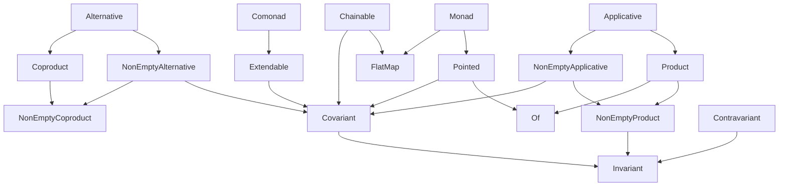

# Introduction

The functional abstractions in `@fp-ts/core` can be broadly divided into two categories.

- Abstractions For Concrete Types - These abstractions define properties of concrete types, such as `number` and `string`, as well as ways of combining those values.
- Abstractions For Parameterized Types - These abstractions define properties of parameterized types such as `ReadonlyArray` and `Option` and ways of combining them.

# Concrete Types

|               | member(s)                  | extends       |
| ------------- | -------------------------- | ------------- |
| **Bounded**   | `maxBound` `minBound`   | **Order**     |
| **Semigroup** | `combine` `combineMany` |               |
| **Monoid**    | `empty` `combineAll`    | **Semigroup** |
| **Order**     | `compare`                  |               |

# Parameterized Types

**Parameterized Types Hierarchy**

## Members and derived functions

Note: members are in bold.

**Alternative** (extends `NonEmptyAlternative`, `Coproduct`)

**Applicative** (extends `NonEmptyApplicative`, `Product`)

| Name       | Given       | To             |
| ---------- | ----------- | -------------- |
| liftMonoid | `Monoid<A>` | `Monoid<F<A>>` |

**Bicovariant**

| Name      | Given                            | To         |
| --------- | -------------------------------- | ---------- |
| **bimap** | `F<E1, A>`, `E1 => E2`, `A => B` | `F<E2, B>` |
| mapLeft   | `F<E1, A>`, `E1 => E2`           | `F<E2, A>` |
| map       | `F<A>`, `A => B`                 | `F<B>`     |

**Bounded** (extends `Order`)

| Name         | Given        | To           |
| ------------ | ------------ | ------------ |
| **maxBound** |              | `A`          |
| **minBound** |              | `A`          |
| clamp        | `A`          | `A`          |
| reverse      | `Bounded<A>` | `Bounded<A>` |

**Chainable** (extends `FlatMap`, `Covariant`)

| Name           | Given                               | To                     |
| -------------- | ----------------------------------- | ---------------------- |
| tap            | `F<A>`, `A => F<B>`                 | `F<A>`                 |
| andThenDiscard | `F<A>`, `F<B>`                      | `F<A>`                 |
| bind           | `F<A>`, `name: string`, `A => F<B>` | `F<A & { [name]: B }>` |

**Comonad** (extends `Extendable`)

| Name        | Given  | To  |
| ----------- | ------ | --- |
| **extract** | `F<A>` | `A` |

**Compactable**

| Name        | Given             | To             |
| ----------- | ----------------- | -------------- |
| **compact** | `F<Option<A>>`    | `F<A>`         |
| separate    | `F<Either<A, B>>` | `[F<A>, F<B>]` |

**Contravariant** (extends `Invariant`)

| Name           | Given               | To        |
| -------------- | ------------------- | --------- |
| **contramap**  | `F<A>`, `B => A`    | `F<B>`    |
| mapComposition | `F<G<A>>`, `A => B` | `F<G<B>>` |
| imap           | `contramap`         | `imap`    |
| flap           | `A`, `F<A => B>`    | `F<B>`    |
| as             | `F<A>`, `B`         | `F<B>`    |
| asUnit         | `F<A>`              | `F<void>` |

**Coproduct** (extends `NonEmptyCoproduct`)

| Name             | Given            | To     |
| ---------------- | ---------------- | ------ |
| **zero**         |                  | `F<A>` |
| **coproductAll** | `Iterable<F<A>>` | `F<A>` |

**Covariant** (extends `Invariant`)

| Name           | Given               | To        |
| -------------- | ------------------- | --------- |
| **map**        | `F<A>`, `A => B`    | `F<B>`    |
| mapComposition | `F<G<A>>`, `A => B` | `F<G<B>>` |
| imap           | `map`               | `imap`    |
| flap           | `A`, `F<A => B>`    | `F<B>`    |
| as             | `F<A>`, `B`         | `F<B>`    |
| asUnit         | `F<A>`              | `F<void>` |

**Extendable** (extends `Covariant`)

| Name       | Given               | To     |
| ---------- | ------------------- | ------ |
| **extend** | `F<A>`, `F<A> => B` | `F<B>` |

**Filterable**

| Name                 | Given                       | To             |
| -------------------- | --------------------------- | -------------- |
| **filterMap**        | `F<A>`, `A => Option<B>`    | `F<B>`         |
| filterMapComposition | `F<G<A>>`, `A => Option<B>` | `F<G<B>>`      |
| filter               | `F<A>`, `A => boolean`      | `F<A>`         |
| partitionMap         | `F<A>`, `A => Either<B, C>` | `[F<B>, F<C>]` |
| partition            | `F<A>`, `A => boolean`      | `[F<A>, F<A>]` |

**FlatMap**

| Name           | Given                    | To          |
| -------------- | ------------------------ | ----------- |
| **flatMap**    | `F<A>`, `A => F<B>`      | `F<B>`      |
| flatten        | `F<F<A>>`                | `F<A>`      |
| andThen        | `F<A>`, `F<B>`           | `F<B>`      |
| composeKleisli | `A => F<B>`, `B => F<C>` | `A => F<C>` |

**Foldable**

| Name                   | Given                         | To                 |
| ---------------------- | ----------------------------- | ------------------ |
| **reduce**             | `F<A>`, `B`, `(B, A) => B`    | `B`                |
| **reduceRight**        | `F<A>`, `B`, `(B, A) => B`    | `B`                |
| reduceComposition      | `F<G<A>>`, `B`, `(B, A) => B` | `B`                |
| reduceRightComposition | `F<G<A>>`, `B`, `(B, A) => B` | `B`                |
| foldMap                | `F<A>`, `Monoid<M>`, `A => M` | `M`                |
| toReadonlyArray        | `F<A>`                        | `ReadonlyArray<A>` |
| toReadonlyArrayWith    | `F<A>`, `A => B`              | `ReadonlyArray<B>` |

**Invariant**

| Name            | Given                         | To                 |
| --------------- | ----------------------------- | ------------------ |
| **imap**        | `F<A>`, `A => B`, `B => A`    | `F<B>`             |
| imapComposition | `F<G<A>>`, `A => B`, `B => A` | `F<G<B>>`          |
| bindTo          | `F<A>`, `name: string`        | `F<{ [name]: A }>` |
| tupled          | `F<A>`                        | `F<[A]>`           |

**Monad** (extends `FlatMap`, `Pointed`)

**Monoid** (extends `Semigroup`)

| Name           | Given                                 | To                            |
| -------------- | ------------------------------------- | ----------------------------- |
| **empty**      |                                       | `A`                           |
| **combineAll** | `Iterable<A>`                         | `A`                           |
| min            | `Bounded<A>`                          | `Monoid<A>`                   |
| max            | `Bounded<A>`                          | `Monoid<A>`                   |
| reverse        | `Monoid<A>`                           | `Monoid<A>`                   |
| struct         | `{ a: Monoid<A>, b: Monoid<B>, ... }` | `Monoid<{ a: A, b: B, ... }>` |
| tuple          | `[Monoid<A>, Monoid<B>, ...]`         | `Monoid<[A, B, ...]>`         |

**NonEmptyAlternative** (extends `NonEmptyCoproduct`, `Covariant`)

**NonEmptyApplicative** (extends `NonEmptyProduct`, `Covariant`)

| Name           | Given               | To                           |
| -------------- | ------------------- | ---------------------------- |
| liftSemigroup  | `Semigroup<A>`      | `Semigroup<F<A>>`            |
| ap             | `F<A => B>`, `F<A>` | `F<B>`                       |
| andThenDiscard | `F<A>`, `F<B>`      | `F<A>`                       |
| andThen        | `F<A>`, `F<B>`      | `F<B>`                       |
| lift2          | `(A, B) => C`       | `(F<A>, F<B>) => F<C>`       |
| lift3          | `(A, B, C) => D`    | `(F<A>, F<B>, F<C>) => F<D>` |

**NonEmptyCoproduct** (extends `Invariant`)

| Name              | Given            | To          |
| ----------------- | ---------------- | ----------- |
| **coproduct**     | `F<A>`, `F<B>`   | `F<A \| B>` |
| **coproductMany** | `Iterable<F<A>>` | `F<A>`      |

**NonEmptyProduct** (extends `Invariant`)

| Name                   | Given                          | To                               |
| ---------------------- | ------------------------------ | -------------------------------- |
| **product**            | `F<A>`, `F<B>`                 | `F<[A, B]>`                      |
| **productMany**        | `F<A>`, `Iterable<F<A>>`       | `F<[A, ...ReadonlyArray<A>]>`    |
| productComposition     | `F<G<A>>`, `F<G<B>>`           | `F<G<[A, B]>>`                   |
| productManyComposition | `F<G<A>>`, `Iterable<F<G<A>>>` | `F<G<[A, ...ReadonlyArray<A>]>>` |
| bindRight              | `F<A>`, `name: string`, `F<B>` | `F<A & { [name]: B }>`           |
| productFlatten         | `F<A>`, `F<B>`                 | `F<[...A, B]>`                   |

**NonEmptyTraversable**

| Name                        | Given                                            | To           |
| --------------------------- | ------------------------------------------------ | ------------ |
| **nonEmptyTraverse**        | `NonEmptyApplicative<F>`, `T<A>`, `A => F<B>`    | `F<T<B>>`    |
| nonEmptyTraverseComposition | `NonEmptyApplicative<F>`, `T<G<A>>`, `A => F<B>` | `F<T<G<B>>>` |
| nonEmptySequence            | `NonEmptyApplicative<F>`, `T<F<A>>`              | `F<T<A>>`    |

**Of**

| Name   | Given | To        |
| ------ | ----- | --------- |
| **of** | `A`   | `F<A>`    |
| unit   |       | `F<void>` |
| Do     |       | `F<{}>`   |

**Order**

| Name                 | Given                       | To                    |
| -------------------- | --------------------------- | --------------------- |
| **compare**          | `A`, `A`                    | `Ordering`            |
| tuple                | `[Order<A>, Order<B>, ...]` | `Order<[A, B, ...]>`  |
| reverse              | `Order<A>`                  | `Order<A>`            |
| contramap            | `Order<A>`, `B => A`        | `Order<B>`            |
| getSemigroup         |                             | `Semigroup<Order<A>>` |
| getMonoid            |                             | `Monoid<Order<A>>`    |
| lessThan             | `A`, `A`                    | `boolean`             |
| greaterThan          | `A`, `A`                    | `boolean`             |
| lessThanOrEqualTo    | `A`, `A`                    | `boolean`             |
| greaterThanOrEqualTo | `A`, `A`                    | `boolean`             |
| min                  | `A`, `A`                    | `boolean`             |
| max                  | `A`, `A`                    | `boolean`             |
| clamp                | `A`, `A`                    | `A`                   |
| between              | `A`                         | `boolean`             |

**Pointed** (extends `Covariant`, `Of`)

**Product** (extends `NonEmptyProduct`, `Of`)

| Name           | Given                       | To                       |
| -------------- | --------------------------- | ------------------------ |
| **productAll** | `Iterable<F<A>>`            | `F<ReadonlyArray<A>>`    |
| struct         | `{ a: F<A>, b: F<B>, ... }` | `F<{ a: A, b: B, ... }>` |
| tuple          | `[F<A>, F<B>, ...]`         | `F<[A, B, ...]>`         |

**Semigroup**

| Name            | Given                                       | To                               |
| --------------- | ------------------------------------------- | -------------------------------- |
| **combine**     | `A`, `A`                                    | `A`                              |
| **combineMany** | `A`, `Iterable<A>`                          | `A`                              |
| min             | `Order<A>`                                  | `Semigroup<A>`                   |
| max             | `Order<A>`                                  | `Semigroup<A>`                   |
| reverse         | `Semigroup<A>`                              | `Semigroup<A>`                   |
| constant        | `A`                                         | `Semigroup<A>`                   |
| struct          | `{ a: Semigroup<A>, b: Semigroup<B>, ... }` | `Semigroup<{ a: A, b: B, ... }>` |
| tuple           | `[Semigroup<A>, Semigroup<B>, ...]`         | `Semigroup<[A, B, ...]>`         |
| intercalate     | `A`, `Semigroup<A>`                         | `Semigroup<A>`                   |
| first           |                                             | `Semigroup<A>`                   |
| last            |                                             | `Semigroup<A>`                   |

**Traversable**

| Name                | Given                                    | To           |
| ------------------- | ---------------------------------------- | ------------ |
| **traverse**        | `Applicative<F>`, `T<A>`, `A => F<B>`    | `F<T<B>>`    |
| traverseComposition | `Applicative<F>`, `T<G<A>>`, `A => F<B>` | `F<T<G<B>>>` |
| sequence            | `Applicative<F>`, `T<F<A>>`              | `F<T<A>>`    |

**TraversableFilterable**

| Name                     | Given                                            | To                |
| ------------------------ | ------------------------------------------------ | ----------------- |
| **traversePartitionMap** | `Applicative<F>`, `T<A>`, `A => F<Either<B, C>>` | `F<[T<B>, T<C>]>` |
| **traverseFilterMap**    | `Applicative<F>`, `T<A>`, `A => F<Option<B>>`    | `F<T<B>>`         |
| traverseFilter           | `Applicative<F>`, `T<A>`, `A => F<boolean>`      | `F<T<A>>`         |
| traversePartition        | `Applicative<F>`, `T<A>`, `A => F<boolean>`      | `F<[T<A>, T<A>]>` |

# Data Types

Additionaly `@fp-ts/core` exports a few data types (types only, implementations are in `@fp-ts/data`)

- `Either`
- `NonEmptyReadonlyArray`
- `Option`
- `Predicate`
- `Refinement`
- `Ordering`
