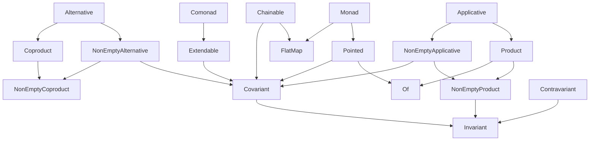

# Introduction

The functional abstractions in `@fp-ts/core` can be broadly divided into two categories.

- Abstractions For Concrete Types - These abstractions define properties of concrete types, such as `number` and `string`, as well as ways of combining those values.
- Abstractions For Parameterized Types - These abstractions define properties of parameterized types such as `ReadonlyArray` and `Option` and ways of combining them.

# Concrete Types

|               | member(s)                  | extends       |
| ------------- | -------------------------- | ------------- |
| **Bounded**   | `maxBound`<br>`minBound`   | **Order**     |
| **Semigroup** | `combine`<br>`combineMany` |               |
| **Monoid**    | `empty`<br>`combineAll`    | **Semigroup** |
| **Order**     | `compare`                  |               |

# Parameterized Types

### Type Class Hierarchy



### All available typeclasses

Note: some of these are omitted from the diagram above because they do not extend any functionality.

|                           | member(s)                                     | extends                                |
| ------------------------- | --------------------------------------------- | -------------------------------------- |
| **Alternative**           |                                               | **Coproduct**, **NonEmptyAlternative** |
| **Applicative**           |                                               | **Product**, **NonEmptyApplicative**   |
| **Bicovariant**           | `bimap`                                       |                                        |
| **Chainable**             |                                               | **Covariant**, **FlatMap**             |
| **Comonad**               | `extract`                                     | **Extendable**                         |
| **Compactable**           | `compact`                                     |                                        |
| **Contravariant**         | `contramap`                                   | **Invariant**                          |
| **Coproduct**             | `zero`<br>`coproductAll`                      | **NonEmptyCoproduct**                  |
| **Covariant**             | `map`                                         | **Invariant**                          |
| **Extendable**            | `extend`                                      | **Covariant**                          |
| **Filterable**            | `filterMap`                                   |                                        |
| **FlatMap**               | `flatMap`                                     |                                        |
| **Foldable**              | `reduce`<br>`reduceRight`                     |                                        |
| **Invariant**             | `imap`                                        |                                        |
| **Monad**                 |                                               | **Pointed**, **FlatMap**               |
| **Monoid**                | `empty`<br>`combineAll`                       | **Semigroup**                          |
| **NonEmptyAlternative**   |                                               | **NonEmptyCoproduct**, **Covariant**   |
| **NonEmptyApplicative**   |                                               | **NonEmptyProduct**, **Covariant**     |
| **NonEmptyCoproduct**     | `coproduct`<br>`coproductMany`                | **Invariant**                          |
| **NonEmptyProduct**       | `product`<br>`productMany`                    |                                        |
| **NonEmptyTraversable**   | `nonEmptyTraverse`                            |                                        |
| **Of**                    | `of`                                          |                                        |
| **Pointed**               |                                               | **Covariant**, **Of**                  |
| **Product**               | `productAll`                                  | **NonEmptyProduct**, **Of**            |
| **Semigroup**             | `combine`<br>`combineMany`                    |                                        |
| **Traversable**           | `traverse`                                    |                                        |
| **TraversableFilterable** | `traversePartitionMap`<br>`traverseFilterMap` |                                        |

# Data Types

Additionaly `@fp-ts/core` exports a few data types (types only, implementations are in `@fp-ts/data`)

- `Either`
- `NonEmptyReadonlyArray`
- `Option`
- `Predicate`
- `Refinement`
- `Ordering`

# Derived functions

**Applicative**

| Name         | Given       | To             |
| ------------ | ----------- | -------------- |
| `liftMonoid` | `Monoid<A>` | `Monoid<F<A>>` |

**Bicovariant**

| Name      | Given                  | To         |
| --------- | ---------------------- | ---------- |
| `mapLeft` | `F<E1, A>`, `E1 => E2` | `F<E2, A>` |
| `map`     | `F<A>`, `A => B`       | `F<B>`     |

**Bounded**

| Name      | Given        | To           |
| --------- | ------------ | ------------ |
| `clamp`   | `A`          | `A`          |
| `reverse` | `Bounded<A>` | `Bounded<A>` |

**Chainable**

| Name             | Given                               | To                     |
| ---------------- | ----------------------------------- | ---------------------- |
| `tap`            | `F<A>`, `A => F<B>`                 | `F<A>`                 |
| `andThenDiscard` | `F<A>`, `F<B>`                      | `F<A>`                 |
| `bind`           | `F<A>`, `name: string`, `A => F<B>` | `F<A & { [name]: B }>` |

**Compactable**

| Name       | Given             | To             |
| ---------- | ----------------- | -------------- |
| `separate` | `F<Either<A, B>>` | `[F<A>, F<B>]` |

**Covariant**

| Name             | Given               | To        |
| ---------------- | ------------------- | --------- |
| `mapComposition` | `F<G<A>>`, `A => B` | `F<G<B>>` |
| `flap`           | `A`, `F<A => B>`    | `F<B>`    |
| `as`             | `F<A>`, `B`         | `F<B>`    |
| `asUnit`         | `F<A>`              | `F<void>` |

**Filterable**

| Name                   | Given                       | To             |
| ---------------------- | --------------------------- | -------------- |
| `filterMapComposition` | `F<G<A>>`, `A => Option<B>` | `F<G<B>>`      |
| `filter`               | `F<A>`, `A => boolean`      | `F<A>`         |
| `partitionMap`         | `F<A>`, `A => Either<B, C>` | `[F<B>, F<C>]` |
| `partition`            | `F<A>`, `A => boolean`      | `[F<A>, F<A>]` |

**FlatMap**

| Name             | Given                    | To          |
| ---------------- | ------------------------ | ----------- |
| `flatten`        | `F<F<A>>`                | `F<A>`      |
| `andThen`        | `F<A>`, `F<B>`           | `F<B>`      |
| `composeKleisli` | `A => F<B>`, `B => F<C>` | `A => F<C>` |

**Foldable**

| Name                     | Given                         | To                 |
| ------------------------ | ----------------------------- | ------------------ |
| `reduceComposition`      | `F<G<A>>`, `B`, `(B, A) => B` | `B`                |
| `reduceRightComposition` | `F<G<A>>`, `B`, `(B, A) => B` | `B`                |
| `foldMap`                | `F<A>`, `Monoid<M>`, `A => M` | `M`                |
| `toReadonlyArray`        | `F<A>`                        | `ReadonlyArray<A>` |
| `toReadonlyArrayWith`    | `F<A>`, `A => B`              | `ReadonlyArray<B>` |

**Invariant**

| Name     | Given                  | To                 |
| -------- | ---------------------- | ------------------ |
| `bindTo` | `F<A>`, `name: string` | `F<{ [name]: A }>` |
| `tupled` | `F<A>`                 | `F<[A]>`           |

**Monoid**

| Name      | Given                                 | To                            |
| --------- | ------------------------------------- | ----------------------------- |
| `min`     | `Bounded<A>`                          | `Monoid<A>`                   |
| `max`     | `Bounded<A>`                          | `Monoid<A>`                   |
| `reverse` | `Monoid<A>`                           | `Monoid<A>`                   |
| `struct`  | `{ a: Monoid<A>, b: Monoid<B>, ... }` | `Monoid<{ a: A, b: B, ... }>` |
| `tuple`   | `[Monoid<A>, Monoid<B>, ...]`         | `Monoid<[A, B, ...]>`         |

**NonEmptyApplicative**

| Name             | Given               | To                           |
| ---------------- | ------------------- | ---------------------------- |
| `liftSemigroup`  | `Semigroup<A>`      | `Semigroup<F<A>>`            |
| `ap`             | `F<A => B>`, `F<A>` | `F<B>`                       |
| `andThenDiscard` | `F<A>`, `F<B>`      | `F<A>`                       |
| `andThen`        | `F<A>`, `F<B>`      | `F<B>`                       |
| `lift2`          | `(A, B) => C`       | `(F<A>, F<B>) => F<C>`       |
| `lift3`          | `(A, B, C) => D`    | `(F<A>, F<B>, F<C>) => F<D>` |

**NonEmptyProduct**

| Name                     | Given                          | To                               |
| ------------------------ | ------------------------------ | -------------------------------- |
| `productComposition`     | `F<G<A>>`, `F<G<B>>`           | `F<G<[A, B]>>`                   |
| `productManyComposition` | `F<G<A>>`, `Iterable<F<G<A>>>` | `F<G<[A, ...ReadonlyArray<A>]>>` |
| `bindRight`              | `F<A>`, `name: string`, `F<B>` | `F<A & { [name]: B }>`           |
| `productFlatten`         | `F<A>`, `F<B>`                 | `F<[...A, B]>`                   |

**NonEmptyTraversable**

| Name                          | Given                  | To           |
| ----------------------------- | ---------------------- | ------------ |
| `nonEmptyTraverseComposition` | `T<F<A>>`, `A => G<B>` | `G<T<F<B>>>` |
| `nonEmptySequence`            | `T<F<A>>`              | `F<T<A>>`    |

**Of**

| Name   | Given | To        |
| ------ | ----- | --------- |
| `unit` |       | `F<void>` |
| `Do`   |       | `F<{}>`   |

**Order**

| Name                   | Given                       | To                    |
| ---------------------- | --------------------------- | --------------------- |
| `tuple`                | `[Order<A>, Order<B>, ...]` | `Order<[A, B, ...]>`  |
| `reverse`              | `Order<A>`                  | `Order<A>`            |
| `contramap`            | `Order<A>`, `B => A`        | `Order<B>`            |
| `getSemigroup`         |                             | `Semigroup<Order<A>>` |
| `getMonoid`            |                             | `Monoid<Order<A>>`    |
| `lessThan`             | `[A, A]`                    | `boolean`             |
| `greaterThan`          | `[A, A]`                    | `boolean`             |
| `lessThanOrEqualTo`    | `[A, A]`                    | `boolean`             |
| `greaterThanOrEqualTo` | `[A, A]`                    | `boolean`             |
| `min`                  | `[A, A]`                    | `boolean`             |
| `max`                  | `[A, A]`                    | `boolean`             |
| `clamp`                | `[A, A]`                    | `A`                   |
| `between`              | `A`                         | `boolean`             |

**Product**

| Name     | Given                       | To                       |
| -------- | --------------------------- | ------------------------ |
| `struct` | `{ a: F<A>, b: F<B>, ... }` | `F<{ a: A, b: B, ... }>` |
| `tuple`  | `[F<A>, F<B>, ...]`         | `F<[A, B, ...]>`         |

**Semigroup**

| Name          | Given                                       | To                               |
| ------------- | ------------------------------------------- | -------------------------------- |
| `min`         | `Order<A>`                                  | `Semigroup<A>`                   |
| `max`         | `Order<A>`                                  | `Semigroup<A>`                   |
| `reverse`     | `Semigroup<A>`                              | `Semigroup<A>`                   |
| `constant`    | `A`                                         | `Semigroup<A>`                   |
| `struct`      | `{ a: Semigroup<A>, b: Semigroup<B>, ... }` | `Semigroup<{ a: A, b: B, ... }>` |
| `tuple`       | `[Semigroup<A>, Semigroup<B>, ...]`         | `Semigroup<[A, B, ...]>`         |
| `intercalate` | `A`, `Semigroup<A>`                         | `Semigroup<A>`                   |
| `first`       |                                             | `Semigroup<A>`                   |
| `last`        |                                             | `Semigroup<A>`                   |

**Traversable**

| Name                  | Given                  | To           |
| --------------------- | ---------------------- | ------------ |
| `traverseComposition` | `T<F<A>>`, `A => G<B>` | `G<T<F<B>>>` |
| `sequence`            | `T<F<A>>`              | `F<T<A>>`    |

**TraversableFilterable**

| Name                | Given                     | To             |
| ------------------- | ------------------------- | -------------- |
| `traverseFilter`    | `T<A>`, `A => F<boolean>` | `F<T<A>>`      |
| `traversePartition` | `T<A>`, `A => F<boolean>` | `[T<A>, T<A>]` |

---

Parameterized Types graph source:

```
digraph ParameterizedTypes {
    "NonEmptyAlternative" -> "NonEmptyCoproduct"
    "NonEmptyAlternative" -> "Covariant"
    "Alternative" -> "Coproduct"
    "Alternative" -> "NonEmptyAlternative"
    "Applicative" -> "Product"
    "Applicative" -> "NonEmptyApplicative"
    "Product" -> "Of"
    "NonEmptyApplicative" -> "NonEmptyProduct"
    "NonEmptyApplicative" -> "Covariant"
    "Chainable" -> "Covariant"
    "Chainable" -> "FlatMap"
    "Comonad" -> "Extendable"
    "Extendable" -> "Covariant"
    "Monad" -> "Pointed"
    "Monad" -> "FlatMap"
    "Pointed" -> "Of"
    "Pointed" -> "Covariant"
    "Product" -> "NonEmptyProduct"
    "Coproduct" -> "NonEmptyCoproduct"
    "NonEmptyProduct" -> "Invariant"
    "Covariant" -> "Invariant"
    "Contravariant" -> "Invariant"
}
```
