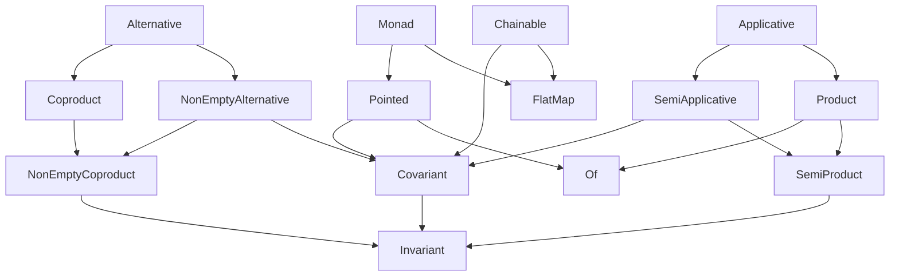

# Introduction

The functional abstractions in `@fp-ts/core` can be broadly divided into two categories.

- Abstractions For Concrete Types - These abstractions define properties of concrete types, such as `number` and `string`, as well as ways of combining those values.
- Abstractions For Parameterized Types - These abstractions define properties of parameterized types such as `ReadonlyArray` and `Option` and ways of combining them.

# Concrete Types

## Members and derived functions

Note: members are in bold.

### Bounded

A type class used to name the lower limit and the upper limit of a type.

Extends:

- `Order`

| Name         | Given        | To           |
| ------------ | ------------ | ------------ |
| **maxBound** |              | `A`          |
| **minBound** |              | `A`          |
| reverse      | `Bounded<A>` | `Bounded<A>` |
| clamp        | `A`          | `A`          |

### Monoid

A monoid is a semigroup with an identity. A monoid is a specialization of a
semigroup, so its operation must be associative. Additionally,
`x |> combine(empty) == empty |> combine(x) == x`. For example, if we have `Monoid<String>`,
with `combine` as string concatenation, then `empty = ""`.

Extends:

- `Semigroup`

| Name           | Given                                 | To                            |
| -------------- | ------------------------------------- | ----------------------------- |
| **empty**      |                                       | `A`                           |
| **combineAll** | `Iterable<A>`                         | `A`                           |
| reverse        | `Monoid<A>`                           | `Monoid<A>`                   |
| tuple          | `[Monoid<A>, Monoid<B>, ...]`         | `Monoid<[A, B, ...]>`         |
| struct         | `{ a: Monoid<A>, b: Monoid<B>, ... }` | `Monoid<{ a: A, b: B, ... }>` |
| min            | `Bounded<A>`                          | `Monoid<A>`                   |
| max            | `Bounded<A>`                          | `Monoid<A>`                   |

### Order

The `Order` type class is used to define a total ordering on some type `A`.
An order is defined by a relation `<=`, which obeys the following laws:

- either `x <= y` or `y <= x` (totality)
- if `x <= y` and `y <= x`, then `x == y` (antisymmetry)
- if `x <= y` and `y <= z`, then `x <= z` (transitivity)

The truth table for compare is defined as follows:

| `x <= y` | `x >= y` | Ordering |                       |
| -------- | -------- | -------- | --------------------- |
| `true`   | `true`   | `0`      | corresponds to x == y |
| `true`   | `false`  | `< 0`    | corresponds to x < y  |
| `false`  | `true`   | `> 0`    | corresponds to x > y  |

By the totality law, `x <= y` and `y <= x` cannot be both `false`.

| Name                 | Given                       | To                    |
| -------------------- | --------------------------- | --------------------- |
| **compare**          | `A`, `A`                    | `Ordering`            |
| reverse              | `Order<A>`                  | `Order<A>`            |
| contramap            | `Order<A>`, `B => A`        | `Order<B>`            |
| getSemigroup         |                             | `Semigroup<Order<A>>` |
| getMonoid            |                             | `Monoid<Order<A>>`    |
| tuple                | `[Order<A>, Order<B>, ...]` | `Order<[A, B, ...]>`  |
| lessThan             | `A`, `A`                    | `boolean`             |
| greaterThan          | `A`, `A`                    | `boolean`             |
| lessThanOrEqualTo    | `A`, `A`                    | `boolean`             |
| greaterThanOrEqualTo | `A`, `A`                    | `boolean`             |
| min                  | `A`, `A`                    | `boolean`             |
| max                  | `A`, `A`                    | `boolean`             |
| clamp                | `A`, `A`                    | `A`                   |
| between              | `A`                         | `boolean`             |

### Semigroup

A semigroup is any set `A` with an associative operation (`combine`):

`x |> combine(y) |> combine(z) == x |> combine(y |> combine(z))`

| Name            | Given                                       | To                               |
| --------------- | ------------------------------------------- | -------------------------------- |
| **combine**     | `A`, `A`                                    | `A`                              |
| **combineMany** | `A`, `Iterable<A>`                          | `A`                              |
| reverse         | `Semigroup<A>`                              | `Semigroup<A>`                   |
| tuple           | `[Semigroup<A>, Semigroup<B>, ...]`         | `Semigroup<[A, B, ...]>`         |
| struct          | `{ a: Semigroup<A>, b: Semigroup<B>, ... }` | `Semigroup<{ a: A, b: B, ... }>` |
| min             | `Order<A>`                                  | `Semigroup<A>`                   |
| max             | `Order<A>`                                  | `Semigroup<A>`                   |
| constant        | `A`                                         | `Semigroup<A>`                   |
| intercalate     | `A`, `Semigroup<A>`                         | `Semigroup<A>`                   |
| first           |                                             | `Semigroup<A>`                   |
| last            |                                             | `Semigroup<A>`                   |

# Parameterized Types

**Parameterized Types Hierarchy**

## Members and derived functions

Note: members are in bold.

### Alternative

Extends:

- `NonEmptyAlternative`
- `Coproduct`

### Applicative

Extends:

- `SemiApplicative`
- `Product`

| Name       | Given       | To             |
| ---------- | ----------- | -------------- |
| liftMonoid | `Monoid<A>` | `Monoid<F<A>>` |

### Bicovariant

A type class of types which give rise to two independent, covariant
functors.

| Name      | Given                            | To         |
| --------- | -------------------------------- | ---------- |
| **bimap** | `F<E1, A>`, `E1 => E2`, `A => B` | `F<E2, B>` |
| mapLeft   | `F<E1, A>`, `E1 => E2`           | `F<E2, A>` |
| map       | `F<A>`, `A => B`                 | `F<B>`     |

### Chainable

Extends:

- `FlatMap`
- `Covariant`

| Name           | Given                               | To                     |
| -------------- | ----------------------------------- | ---------------------- |
| tap            | `F<A>`, `A => F<B>`                 | `F<A>`                 |
| andThenDiscard | `F<A>`, `F<B>`                      | `F<A>`                 |
| bind           | `F<A>`, `name: string`, `A => F<B>` | `F<A & { [name]: B }>` |

### Compactable

`Compactable` represents data structures which can be compacted / separated.

| Name        | Given             | To             |
| ----------- | ----------------- | -------------- |
| **compact** | `F<Option<A>>`    | `F<A>`         |
| separate    | `F<Either<A, B>>` | `[F<A>, F<B>]` |

### Contravariant

Contravariant functors.

Extends:

- `Invariant`

| Name                 | Given               | To        |
| -------------------- | ------------------- | --------- |
| **contramap**        | `F<A>`, `B => A`    | `F<B>`    |
| contramapComposition | `F<G<A>>`, `A => B` | `F<G<B>>` |
| imap                 | `contramap`         | `imap`    |

### Coproduct

`Coproduct` is a universal monoid which operates on kinds.

This type class is useful when its type parameter `F<_>` has a
structure that can be combined for any particular type, and which
also has a "zero" representation. Thus, `Coproduct` is like a `Monoid`
for kinds (i.e. parametrized types).

A `Coproduct<F>` can produce a `Monoid<F<A>>` for any type `A`.

Here's how to distinguish `Monoid` and `Coproduct`:

- `Monoid<A>` allows `A` values to be combined, and also means there
  is an "empty" `A` value that functions as an identity.

- `Coproduct<F>` allows two `F<A>` values to be combined, for any `A`. It
  also means that for any `A`, there is an "zero" `F<A>` value. The
  combination operation and zero value just depend on the
  structure of `F`, but not on the structure of `A`.

Extends:

- `NonEmptyCoproduct`

| Name             | Given            | To             |
| ---------------- | ---------------- | -------------- |
| **zero**         |                  | `F<A>`         |
| **coproductAll** | `Iterable<F<A>>` | `F<A>`         |
| getMonoid        |                  | `Monoid<F<A>>` |

### Covariant

Covariant functors.

Extends:

- `Invariant`

| Name           | Given               | To        |
| -------------- | ------------------- | --------- |
| **map**        | `F<A>`, `A => B`    | `F<B>`    |
| mapComposition | `F<G<A>>`, `A => B` | `F<G<B>>` |
| imap           | `map`               | `imap`    |
| flap           | `A`, `F<A => B>`    | `F<B>`    |
| as             | `F<A>`, `B`         | `F<B>`    |
| asUnit         | `F<A>`              | `F<void>` |

### Filterable

`Filterable<F>` allows you to `map` and filter out elements simultaneously.

| Name                 | Given                       | To             |
| -------------------- | --------------------------- | -------------- |
| **filterMap**        | `F<A>`, `A => Option<B>`    | `F<B>`         |
| filterMapComposition | `F<G<A>>`, `A => Option<B>` | `F<G<B>>`      |
| filter               | `F<A>`, `A => boolean`      | `F<A>`         |
| partitionMap         | `F<A>`, `A => Either<B, C>` | `[F<B>, F<C>]` |
| partition            | `F<A>`, `A => boolean`      | `[F<A>, F<A>]` |

### FlatMap

| Name                | Given                    | To          |
| ------------------- | ------------------------ | ----------- |
| **flatMap**         | `F<A>`, `A => F<B>`      | `F<B>`      |
| flatten             | `F<F<A>>`                | `F<A>`      |
| andThen             | `F<A>`, `F<B>`           | `F<B>`      |
| composeKleisliArrow | `A => F<B>`, `B => F<C>` | `A => F<C>` |

### Foldable

Data structures that can be folded to a summary value.

In the case of a collection (such as `ReadonlyArray`), these
methods will fold together (combine) the values contained in the
collection to produce a single result. Most collection types have
`reduce` methods, which will usually be used by the associated
`Foldable<F>` instance.

| Name                | Given                                     | To                 |
| ------------------- | ----------------------------------------- | ------------------ |
| **reduce**          | `F<A>`, `B`, `(B, A) => B`                | `B`                |
| reduceComposition   | `F<G<A>>`, `B`, `(B, A) => B`             | `B`                |
| reduceRight         | `F<A>`, `B`, `(B, A) => B`                | `B`                |
| foldMap             | `F<A>`, `Monoid<M>`, `A => M`             | `M`                |
| toReadonlyArray     | `F<A>`                                    | `ReadonlyArray<A>` |
| toReadonlyArrayWith | `F<A>`, `A => B`                          | `ReadonlyArray<B>` |
| reduceKind          | `Monad<G>`, `F<A>`, `B`, `(B, A) => G<B>` | `G<B>`             |
| reduceRightKind     | `Monad<G>`, `F<A>`, `B`, `(B, A) => G<B>` | `G<B>`             |
| foldMapKind         | `Coproduct<G>`, `F<A>`, `(A) => G<B>`     | `G<B>`             |

### Invariant

Invariant functors.

| Name            | Given                         | To                 |
| --------------- | ----------------------------- | ------------------ |
| **imap**        | `F<A>`, `A => B`, `B => A`    | `F<B>`             |
| imapComposition | `F<G<A>>`, `A => B`, `B => A` | `F<G<B>>`          |
| bindTo          | `F<A>`, `name: string`        | `F<{ [name]: A }>` |
| tupled          | `F<A>`                        | `F<[A]>`           |

### Monad

Allows composition of dependent effectful functions.

Extends:

- `FlatMap`
- `Pointed`

### NonEmptyAlternative

Extends:

- `NonEmptyCoproduct`
- `Covariant`

### NonEmptyCoproduct

`NonEmptyCoproduct` is a universal semigroup which operates on kinds.

This type class is useful when its type parameter `F<_>` has a
structure that can be combined for any particular type. Thus,
`NonEmptyCoproduct` is like a `Semigroup` for kinds (i.e. parametrized
types).

A `NonEmptyCoproduct<F>` can produce a `Semigroup<F<A>>` for any type A.

Here's how to distinguish `Semigroup` and `NonEmptyCoproduct`:

- `Semigroup<A>` allows two `A` values to be combined.

- `NonEmptyCoproduct<F>` allows two `F<A>` values to be combined, for any `A`.
  The combination operation just depends on the structure of `F`,
  but not the structure of `A`.

Extends:

- `Invariant`

| Name              | Given            | To                |
| ----------------- | ---------------- | ----------------- |
| **coproduct**     | `F<A>`, `F<B>`   | `F<A \| B>`       |
| **coproductMany** | `Iterable<F<A>>` | `F<A>`            |
| getSemigroup      |                  | `Semigroup<F<A>>` |
| coproductEither   | `F<A>`, `F<B>`   | `F<Either<A, B>>` |

### NonEmptyTraversable

`NonEmptyTraversable`, also known as `Traversable1`.

`NonEmptyTraversable` is like a non-empty `Traversable`. Unlike the `traverse` and `sequence`
methods of `Traversable` it provides `traverseNonEmpty` and `sequenceNonEmpty` methods which require a `SemiApplicative`
instance instead of `Applicative`.

| Name                        | Given                                        | To           |
| --------------------------- | -------------------------------------------- | ------------ |
| **traverseNonEmpty**        | `SemiApplicative<F>`, `T<A>`, `A => F<B>`    | `F<T<B>>`    |
| **sequenceNonEmpty**        | `SemiApplicative<F>`, `T<F<A>>`              | `F<T<A>>`    |
| traverseNonEmptyComposition | `SemiApplicative<F>`, `T<G<A>>`, `A => F<B>` | `F<T<G<B>>>` |
| sequenceNonEmptyComposition | `SemiApplicative<F>`, `T<G<F<A>>>`           | `F<T<G<A>>>` |

### Of

| Name          | Given | To        |
| ------------- | ----- | --------- |
| **of**        | `A`   | `F<A>`    |
| ofComposition | `A`   | `F<G<A>>` |
| unit          |       | `F<void>` |
| Do            |       | `F<{}>`   |

### Pointed

Extends:

- `Covariant`
- `Of`

### Product

Extends:

- `SemiProduct`
- `Of`

| Name           | Given                       | To                       |
| -------------- | --------------------------- | ------------------------ |
| **productAll** | `Iterable<F<A>>`            | `F<ReadonlyArray<A>>`    |
| tuple          | `[F<A>, F<B>, ...]`         | `F<[A, B, ...]>`         |
| struct         | `{ a: F<A>, b: F<B>, ... }` | `F<{ a: A, b: B, ... }>` |

### SemiApplicative

Extends:

- `SemiProduct`
- `Covariant`

| Name           | Given               | To                           |
| -------------- | ------------------- | ---------------------------- |
| liftSemigroup  | `Semigroup<A>`      | `Semigroup<F<A>>`            |
| ap             | `F<A => B>`, `F<A>` | `F<B>`                       |
| andThenDiscard | `F<A>`, `F<B>`      | `F<A>`                       |
| andThen        | `F<A>`, `F<B>`      | `F<B>`                       |
| lift2          | `(A, B) => C`       | `(F<A>, F<B>) => F<C>`       |
| lift3          | `(A, B, C) => D`    | `(F<A>, F<B>, F<C>) => F<D>` |

### SemiProduct

Extends:

- `Invariant`

| Name                   | Given                          | To                               |
| ---------------------- | ------------------------------ | -------------------------------- |
| **product**            | `F<A>`, `F<B>`                 | `F<[A, B]>`                      |
| **productMany**        | `F<A>`, `Iterable<F<A>>`       | `F<[A, ...ReadonlyArray<A>]>`    |
| productComposition     | `F<G<A>>`, `F<G<B>>`           | `F<G<[A, B]>>`                   |
| productManyComposition | `F<G<A>>`, `Iterable<F<G<A>>>` | `F<G<[A, ...ReadonlyArray<A>]>>` |
| nonEmptyTuple          | `[F<A>, F<B>, ...]`            | `F<[A, B, ...]>`                 |
| nonEmptyStruct         | `{ a: F<A>, b: F<B>, ... }`    | `F<{ a: A, b: B, ... }>`         |
| andThenBind            | `F<A>`, `name: string`, `F<B>` | `F<A & { [name]: B }>`           |
| productFlatten         | `F<A>`, `F<B>`                 | `F<[...A, B]>`                   |

### Traversable

Traversal over a structure with an effect.

| Name                | Given                                    | To           |
| ------------------- | ---------------------------------------- | ------------ |
| **traverse**        | `Applicative<F>`, `T<A>`, `A => F<B>`    | `F<T<B>>`    |
| **sequence**        | `Applicative<F>`, `T<F<A>>`              | `F<T<A>>`    |
| traverseComposition | `Applicative<F>`, `T<G<A>>`, `A => F<B>` | `F<T<G<B>>>` |
| sequenceComposition | `Applicative<F>`, `T<G<F<A>>>`           | `F<T<G<A>>>` |
| traverseTap         | `Applicative<F>`, `T<A>`, `A => F<B>`    | `F<T<A>>`    |

### TraversableFilterable

`TraversableFilterable`, also known as `Witherable`, represents list-like structures
that can essentially have a `traverse` and a `filter` applied as a single
combined operation (`traverseFilter`).

| Name                     | Given                                            | To                |
| ------------------------ | ------------------------------------------------ | ----------------- |
| **traversePartitionMap** | `Applicative<F>`, `T<A>`, `A => F<Either<B, C>>` | `F<[T<B>, T<C>]>` |
| **traverseFilterMap**    | `Applicative<F>`, `T<A>`, `A => F<Option<B>>`    | `F<T<B>>`         |
| traverseFilter           | `Applicative<F>`, `T<A>`, `A => F<boolean>`      | `F<T<A>>`         |
| traversePartition        | `Applicative<F>`, `T<A>`, `A => F<boolean>`      | `F<[T<A>, T<A>]>` |

# Data Types

Additionaly `@fp-ts/core` exports a few data types (types only, implementations are in `@fp-ts/data`)

- `Either<out E, out A>`
- `Option<out A>`

---

Adapted from:

- [cats](https://github.com/typelevel/cats)
- [zio-prelude](https://github.com/zio/zio-prelude)
- [zio-cheatsheet](https://github.com/ghostdogpr/zio-cheatsheet)
